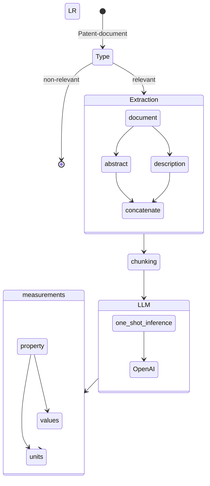

# Challenge - Patent Analysis

## Measurement Extraction

## Flow Diagram

### TodoList

- [] Understand the concept
- [x] One-Shot inference

## Acknowledgements

- [Matthew Shaxted](https://github.com/mattshax/ipagent) (Parser)
- [OpenAI](https://openai.com/) (provided helpful advise and chatgpt4 access)
