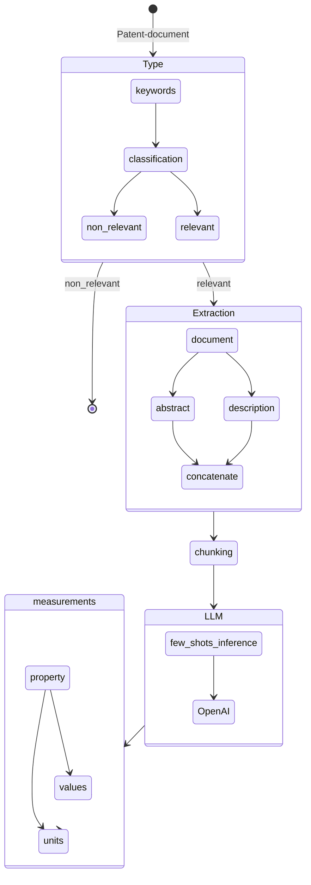

# Challenge - Patent Analysis

## Measurement Extraction

## Flow Diagram

## Validation

- [] using the chroma db vector database, and compare the results with each vector so that we can have close score, i.e. that it is in the text.

### TodoList

- [x] Understand the concept
- [x] Few-Shot inference
- [] Validation

## Acknowledgements

- [Matthew Shaxted](https://github.com/mattshax/ipagent) (Parser)
- [OpenAI](https://openai.com/) (provided helpful advise and chatgpt4 access)
