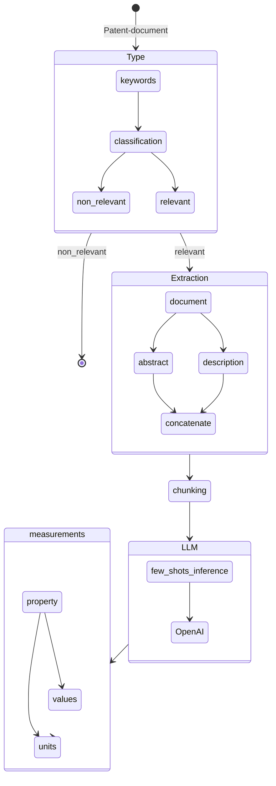

# Challenge - Patent Analysis

The purpose of this challenge is to address the issue of effectively extracting information from a given patent. Specifically, the challenge focuses on the extraction of product, component, or compound values and their corresponding units. Extracting this information accurately is crucial for understanding the patent's technical details and leveraging its insights for various applications. By developing innovative techniques and tools to automate the extraction process, this challenge aims to enhance efficiency and accessibility in patent analysis, thereby facilitating advancements in relevant industries and fostering intellectual property exploration.

## Table of Contents

- [Instructions for Use](#instructions-for-use)
  - [Clone the Repository and Install Python Dependencies](#clone-the-repository-and-install-python-dependencies)
  - [Acquiring the Data from USPTO](#acquiring-the-data-from-uspto)
  - [Parse the XML File to JSON File](#parse-the-xml-file-to-json-file)
  - [Environment Variables Setting for Azure OpenAI Setup](#environment-variables-setting-for-azure-openai-setup)
  - [Testing the System with Given Patent URL](#testing-the-system-with-given-patent-url)
- [Prerequisites](#prerequisites)
- [TodoList](#todolist)
- [Flow Diagram](#flow-diagram)
- [Data Description](#data-description)
- [System Architecture](#system-architecture)
- [Examples and Expected Output](#examples-and-expected-output)
- [Troubleshooting and FAQs](#troubleshooting-and-faqs)
- [Contributing](#contributing)
- [Contact Information](#contact-information)
- [Acknowledgements](#acknowledgements)

## Instructions for Use

### Clone the Repository and Install Python Dependencies

```bash
git clone https://github.com/rizwanishaq/basf_challenge.git
cd basf_challenge

# Python 3.10 is used for this project, although other versions could work as well but not tested

python3 -m venv basf
source basf/bin/activate

pip3 install -r requirements.txt
```

### Acquiring the Data from USPTO

```bash
mkdir data
cd data
wget https://bulkdata.uspto.gov/data/patent/grant/redbook/fulltext/2023/ipg230103.zip
unzip ipg230103.zip
```

### Parse the XML File to JSON File

```bash
python3 parse_data.py
```

This will create the `ipg230103.json` file in the data folder, which we can use afterwards for our system testing purposes.

### Environment Variables Setting for Azure OpenAI Setup

Before testing the patent-analysis system, we need to set the environment variable first. Create a `.env` file:

```bash
touch .env
```

Write your credentials in the `.env` file:

```plaintext
OPENAI_API_TYPE=azure
OPENAI_API_KEY="put your open api key here"
OPENAI_API_BASE="put the end point url here"
OPENAI_API_VERSION = 2023-03-15-preview
```

### Testing the System with Given Patent URL

```bash
python3 app.py --patent-url "https://patents.google.com/patent/US8022010B2/en"
```

This will generate the output like this

```plaintext
Product: TiN film
Property: average film thickness
Value: 3
unit: µm
sentence: The material in which a TiN film having an average film thickness of 3 µm had been formed on the surface of Present product 1 was made Present product 17, and the material in which a TiAlN film having an average film thickness of 3 µm had been formed on the surface of Present product 1 was made Present product 18.
```

## Flow Diagram



## TodoList

- [x] Understand the concept
- [x] Few-Shot inference
- [x] Prototype
- [x] Flow Diagram
- [ ] Measurement database, MongoDB
- [x] Slides
- [ ] suggestions
- [ ] Optimization of validation
- [ ] Annotations generation
- [ ] Evaluation of the System

## Prerequisites

- Python 3.10
- Other dependencies listed in requirements.txt

## Data Description

The data for this challenge is obtained from the USPTO (United States Patent and Trademark Office). It is in the form of XML files, which need to be parsed and converted into JSON format for further processing.

## System Architecture

The patent analysis system follows the following flow:

1.  Type Classification: Determine the relevance of the patent document based on keywords and classification.

2.  Extraction: Extract relevant information from the document, including abstract and description sections.

3.  Chunking: Chunk the extracted information for further analysis.

4.  Language Model Inference: Use OpenAI's language model for few-shot inference to generate insights.

5.  Measurement Extraction: Extract measurements, properties, values, and units from the generated insights.

## Examples and Expected Output

- Patent URL: https://patents.google.com/patent/US8501236B2/en
- Patent URL: https://patents.google.com/patent/EP2778146A1/en
- Patent Title: PHighly reactive, dust-free and free-flowing lithium sulphide and method for the production thereof

```bash
  python3 validate.py
```

| Product                           | Property                          | Value                                                               | Unit   |                                                                                                                                                                                                                                                                                                                                                                                                                                                                                                                                                                                                                                                                                                                                                                                                                                   Sentence |
| --------------------------------- | :-------------------------------- | ------------------------------------------------------------------- | ------ | -----------------------------------------------------------------------------------------------------------------------------------------------------------------------------------------------------------------------------------------------------------------------------------------------------------------------------------------------------------------------------------------------------------------------------------------------------------------------------------------------------------------------------------------------------------------------------------------------------------------------------------------------------------------------------------------------------------------------------------------------------------------------------------------------------------------------------------------: |
| ceria particles in red            | crystallite size in green         | between 10 and 20                                                   | nm     |                                                                                                                                                                                                                                                                                                                                                                                                                                                                                                                                                                            In one embodiment, the nitrogen oxide storage material comprises alkaline earth material supported on ceria particles having a crystallite size of between about 10 and 20 nm and the alkaline earth oxide having a crystallite size of between about 20-40 nm. |
| ALKAINE EARTH MATERIAL            | crystallite size                  | between 10 and 20                                                   | nm     |                                                                                                                                                                                                                                                                                                                                                                                                                                                                                                                                                                            In one embodiment, the nitrogen oxide storage material comprises alkaline earth material supported on ceria particles having a crystallite size of between about 10 and 20 nm and the alkaline earth oxide having a crystallite size of between about 20-40 nm. |
| ALKAINE EARTH OXIDE               | crystallite size in green         | between 20-40                                                       | nm     |                                                                                                                                                                                                                                                                                                                                                                                                                                                                                                                                                                            In one embodiment, the nitrogen oxide storage material comprises alkaline earth material supported on ceria particles having a crystallite size of between about 10 and 20 nm and the alkaline earth oxide having a crystallite size of between about 20-40 nm. |
| BaCO3/CeO2 composite              | SEM image                         | null                                                                | null   |                                                                                                                                                                                                                                                                                                                                                                                                                                                                                                                                                                                                                                                                                                                                             sentence: FIG. 6 is a SEM image of the spray dried and calcined BaCO3/CeO2 composite material. |
| BaCO3                             | thermal stress reduction          | reduced                                                             |        |                                                                                                                                                                                                                                                                                                                                                                                                                                                                                                                                                                                                                                         According to one or more embodiments of the invention, Ba sintering and Ba composite compound formation is reduced under the conditions of thermal stress in an exhaust gas of a lean burn engine. |
| NOX STORAGE MATERIAL              | demonstrated NOx storage capacity | improved                                                            |        |                                                                                                                                                                                                                                                                                                                                                                                                                                                                                                                                                                                                                                                                   The NOx storage material according to embodiments of the present invention demonstrates improved NOx storage capacity after thermal aging when used in a catalytic trap. |
| BACO3/Ceo2 PARTICLES              | particle size                     | 3-30                                                                | micron |                                                                                                                                                                                                                                                                                                                                                                                                                                                                                                                                                                                                                                                                                                            The coating on the honeycomb catalyst comprises about 3-30 micron BaCO3/CeO2 particles and about 1-20 micron alumina particles. |
| ALUMINA PARTICLES                 | particle size                     | 1-20                                                                | micron |                                                                                                                                                                                                                                                                                                                                                                                                                                                                                                                                                                                                                                                                                                            The coating on the honeycomb catalyst comprises about 3-30 micron BaCO3/CeO2 particles and about 1-20 micron alumina particles. |
| NOX                               | NOx storage mass(g)               | NOx *{dot over (V)}/V ideal *M S*1/(3.6*106)                        | g      |                                                                                                                                                                                                                                                                                                                                                                                                                                                                                                                                                                                                                                                                                                                                                                                      NOx storage mass in g is calculated via equation (2): |
| NOX                               | NOx concentration                 | NOx                                                                 | ppm    |                                                                                                                                                                                                                                                                                                                                                                                                                                                                                                                                                                                                                                                                                     For the time period of the 10 lean/rich cycles the NOx efficiency (U) is calculated from the NOx inlet and NOx outlet concentrations via equation (1): |
| REFRACTORY OXIDE                  | surface area                      | between 5 and 350                                                   | m2/g   |                                                                                                                                                                                                                                                                                                                                                                                                                                                                                                                                                                                                                                                                                                                             The method of claim 13, wherein the refractory oxide has a surface area of between about 5 and about 350 m2/g. |
| CUBIC BORON NITRIDE               | average grain size                | 0.5 to 5                                                            | µm     | An average grain size of the cubic boron nitride of the present invention is not particularly limited, but if the average grain size of the cubic boron nitride is less than 0.5 µm, an oxygen amount adsorbed on the surface of the cubic boron nitride is increased to inhibit the sintering reaction, whereby sinterability tends to be lowered, while if the average grain size becomes large exceeding 5 µm, the binder phase tends to be agglomerated, so that the thickness of the binder phase which is brittle as compared to the cubic boron nitride becomes large and fracture resistance tends to be lowered. Therefore, the average grain size of the cubic boron nitride of the present invention is preferably 0.5 to 5 µm. Among these, the average grain size of the cubic boron nitride is further preferably 1 to 3 µm. |
| CUBIC BORON NITRIDE SINTERED BODY | inevitable impurities             | 5% by mass or less                                                  |        |                                                                                                                                                                                                                                                                                                                                                                                                                                                                                                                                                                                                                                                                                             The total amount of the inevitable impurities is generally 5% by mass or less based on the total mass of the cubic boron nitride sintered body |
| CUBIC BORON NITRIDE SINTERED BODY | tungsten element                  | 5% by mass or less                                                  |        |                                                                                                                                                                                                                                                                                                                                                                                                                                                                           Therefore, the amount of the tungsten element contained in the cubic boron nitride sintered body of the present invention is preferably 5% by mass or less based on the total mass of the cubic boron nitride sintered body since cutting properties are improved, and among these, the amount of the tungsten element is further preferably 3% by mass or less. |
| CUBIC BORON NITRIDE               | average grain size                | 0.5 to 5                                                            | µm     |                                                                                                                                                                                                                                                                                                                                                                                                                                                                                                                                                                                                                                                                                                                           Therefore, the average grain size of the cubic boron nitride of the present invention is preferably 0.5 to 5 µm. |
| CNGA120408                        | insert shape                      | None                                                                |        |                                                                                                                                                                                                                                                                                                                                                                                                                                                                                                                                                                                                                                                                                                                                                                                                                  Insert shape: CNGA120408, |
| DCLNR2525M12                      | holder                            | None                                                                | None   |                                                                                                                                                                                                                                                                                                                                                                                                                                                                                                                                                                                                                                                                                                                                                                                                                      Holder: DCLNR2525M12, |
| None                              | Cutting speed                     | 300                                                                 | m/min  |                                                                                                                                                                                                                                                                                                                                                                                                                                                                                                                                                                                                                                                                                                                                                                                                                  Cutting speed: 300 m/min, |
| CUBIC BORON NITRIDE               | average grain size                | 0.5 to 5                                                            | µm     |                                                                                                                                                                                                                                                                                                                                                                                                                                                                                                                                                                                                                                                                                                                           Therefore, the average grain size of the cubic boron nitride of the present invention is preferably 0.5 to 5 µm. |
| LITHIUM SULFIDE POWDER            | particle size                     | between 250 and 1,500                                               | µm     |                                                                                                                                                                                                                                                                                                                                                                                                                                                                                                                                                                                                                          The invention relates to a highly reactive, high-purity, free-flowing and dust-free lithium sulfide powder having an average particle size between 250 and 1,500 μm and BET surface areas between 1 and 100 m2/g. |
| LITHIUM SULFIDE POWDER            | surface area                      | between 1 and 100                                                   | m2/g   |                                                                                                                                                                                                                                                                                                                                                                                                                                                                                                                                                                                                                          The invention relates to a highly reactive, high-purity, free-flowing and dust-free lithium sulfide powder having an average particle size between 250 and 1,500 μm and BET surface areas between 1 and 100 m2/g. |
| LITHIUM HYDROXIDE                 | residual water content            | less than 5                                                         | wt. %  |                                                                                                                                                                                                                                                                                                                                                                                                                                                                                                                                                                                                                                         Surprisingly, however, the morphology of the produced anhydrous lithium hydroxide (residual water content of less than 5 wt. %) differs significantly depending on the selected drying conditions. |
| LITHIUM HYDROXIDE                 | BET surface area                  | smaller for low drying temperatures than for temperatures above 200 | °C. %  |                                                                                                                                                                                                                                                                                                                                                                                                                                                                                                                                                                                                                                   This property correlates with the BET surface area of the porous lithium hydroxide particles, which is smaller for low drying temperatures than for temperatures above 200° C. (Examples 1, 2, 5 and 6). |
| LI6PS5BR                          | composition                       | slithium sulfide                                                    | %      |                                                                                                                                                                                                                                                                                                                                                                                                                                                                                                                                                                                                                      To study reactivity of the produced lithium sulfide powders, a process for producing the sulfidic solid electrolyte of the composition Li6PS5Br was found in the literature [Solid State Ionics, 2014, 262, 183-187]. |
|                                   | reaction temperature of step 2    | between 200 and 400                                                 | °C.    |                                                                                                                                                                                                                                                                                                                                                                                                                                                                                                                                                                                                                                                                                                                   The process according to claim 2, characterized in that the reaction temperature of step 2 is between 20° C. and 450° C. |
|                                   | reaction temperature of step 2    | between 20 and 450                                                  | °C.    |                                                                                                                                                                                                                                                                                                                                                                                                                                                                                                                                                                                                                                                                                                                  The process according to claim 2, characterized in that the reaction temperature of step 2 is between 200° C. and 400° C. |

---

## Troubleshooting and FAQs

I have to devise the evaluation for this task, at moment I'm not sure, how can I do it automatically.

## Contributing

Contributions are welcome! If you find any issues or have suggestions for improvements, please submit a pull request or open an issue in the [GitHub repository](https://github.com/rizwanishaq/basf_challenge).

## Contact Information

For further information or inquiries, please contact [Rizwan Ishaq](mailto:rizwanishaq@gmail.com)

## Acknowledgements

- [Matthew Shaxted](https://github.com/mattshax/ipagent) (Parser)
- [OpenAI](https://openai.com/) (provided helpful advise and chatgpt4 access)

```

```

```

```
