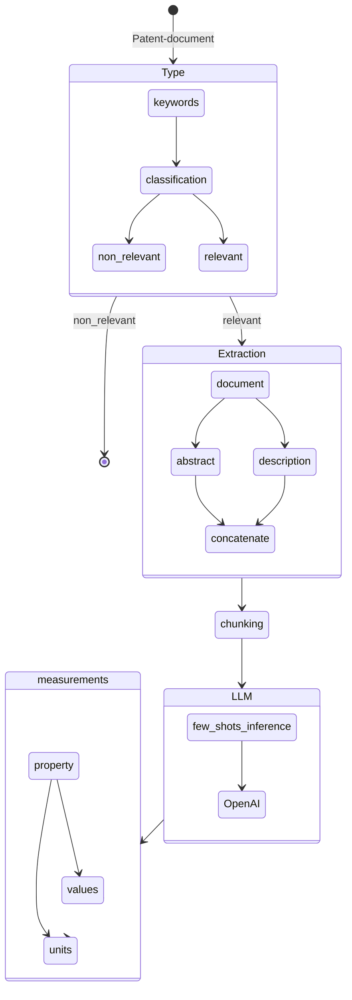

# Challenge - Patent Analysis

The purpose of this challenge is to address the issue of effectively extracting information from a given patent. Specifically, the challenge focuses on the extraction of product, component, or compound values and their corresponding units. Extracting this information accurately is crucial for understanding the patent's technical details and leveraging its insights for various applications. By developing innovative techniques and tools to automate the extraction process, this challenge aims to enhance efficiency and accessibility in patent analysis, thereby facilitating advancements in relevant industries and fostering intellectual property exploration.

## Instructions for use

### clone the repo and install python dependencies

```bash
git clone https://github.com/rizwanishaq/basf_challenge.git
cd basf_challenge

# python3.10 is used for this project, although other versions could work as well but not tested

python3 -m venv basf
source basf/bin/activate

pip3 install -r requirements.txt

```

### Acquiring the data from USTOP.

```bash
mkdir data
cd data
wget https://bulkdata.uspto.gov/data/patent/grant/redbook/fulltext/2023/ipg230103.zip
unzip ipg230103.zip
```

### Parse the .xml file to json file

```bash
python3 parse_data.py
```

It will create the ipg230103.json in data folder which we can use afterwards for our system testing purposes.

### environment variables setting for Azure openai setup

Before testing the patent-analysis system, we need to set the environment variable first, create a .env

```bash
touch .env
```

write the your credentials in .env file:

```.env
OPENAI_API_TYPE=azure
OPENAI_API_KEY="put your open api key here"
OPENAI_API_BASE="put the end point url here"
OPENAI_API_VERSION = 2023-03-15-preview
```

### Testing the system with given patent url given in the challenge file

```bash
python3 app.py --patent-url "https://patents.google.com/patent/US8022010B2/en"
```

This will generate the output like this

```sh
Product: TiN film
Property: average film thickness
Value: 3
unit: µm
sentence: The material in which a TiN film having an average film thickness of 3 µm had been formed on the surface of Present product 1 was made Present product 17, and the material in which a TiAlN film having an average film thickness of 3 µm had been formed on the surface of Present product 1 was made Present product 18.
```

### TodoList

- [x] Understand the concept
- [x] Few-Shot inference
- [x] Prototype
- [x] Flow Diagram
- [ ] Measurement database, MongoDB

## Flow Diagram



## Acknowledgements

- [Matthew Shaxted](https://github.com/mattshax/ipagent) (Parser)
- [OpenAI](https://openai.com/) (provided helpful advise and chatgpt4 access)

```

```
