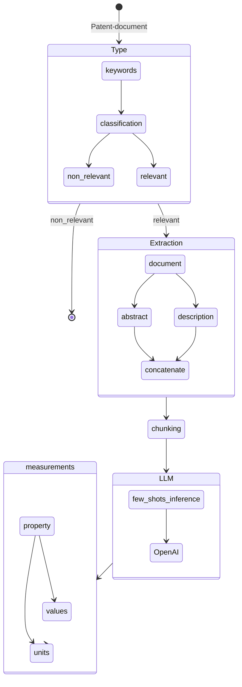

# Challenge - Patent Analysis

The purpose of this challenge is to address the issue of effectively extracting information from a given patent. Specifically, the challenge focuses on the extraction of product, component, or compound values and their corresponding units. Extracting this information accurately is crucial for understanding the patent's technical details and leveraging its insights for various applications. By developing innovative techniques and tools to automate the extraction process, this challenge aims to enhance efficiency and accessibility in patent analysis, thereby facilitating advancements in relevant industries and fostering intellectual property exploration.

## Table of Contents

- [Instructions for Use](#instructions-for-use)
  - [Clone the Repository and Install Python Dependencies](#clone-the-repository-and-install-python-dependencies)
  - [Acquiring the Data from USPTO](#acquiring-the-data-from-uspto)
  - [Parse the XML File to JSON File](#parse-the-xml-file-to-json-file)
  - [Environment Variables Setting for Azure OpenAI Setup](#environment-variables-setting-for-azure-openai-setup)
  - [Testing the System with Given Patent URL](#testing-the-system-with-given-patent-url)
- [Prerequisites](#prerequisites)
- [TodoList](#todolist)
- [Flow Diagram](#flow-diagram)
- [Data Description](#data-description)
- [System Architecture](#system-architecture)
- [Examples and Expected Output](#examples-and-expected-output)
- [Troubleshooting and FAQs](#troubleshooting-and-faqs)
- [Contributing](#contributing)
- [Contact Information](#contact-information)
- [Acknowledgements](#acknowledgements)

## Instructions for Use

### Clone the Repository and Install Python Dependencies

```bash
git clone https://github.com/rizwanishaq/basf_challenge.git
cd basf_challenge

# Python 3.10 is used for this project, although other versions could work as well but not tested

python3 -m venv basf
source basf/bin/activate

pip3 install -r requirements.txt
```

### Acquiring the Data from USPTO

```bash
mkdir data
cd data
wget https://bulkdata.uspto.gov/data/patent/grant/redbook/fulltext/2023/ipg230103.zip
unzip ipg230103.zip
```

### Parse the XML File to JSON File

```bash
python3 parse_data.py
```

This will create the `ipg230103.json` file in the data folder, which we can use afterwards for our system testing purposes.

### Environment Variables Setting for Azure OpenAI Setup

Before testing the patent-analysis system, we need to set the environment variable first. Create a `.env` file:

```bash
touch .env
```

Write your credentials in the `.env` file:

```plaintext
OPENAI_API_TYPE=azure
OPENAI_API_KEY="put your open api key here"
OPENAI_API_BASE="put the end point url here"
OPENAI_API_VERSION = 2023-03-15-preview
```

### Testing the System with Given Patent URL

```bash
python3 app.py --patent-url "https://patents.google.com/patent/US8022010B2/en"
```

This will generate the output like this

```plaintext
Product: TiN film
Property: average film thickness
Value: 3
unit: µm
sentence: The material in which a TiN film having an average film thickness of 3 µm had been formed on the surface of Present product 1 was made Present product 17, and the material in which a TiAlN film having an average film thickness of 3 µm had been formed on the surface of Present product 1 was made Present product 18.
```

## Flow Diagram



## TodoList

- [x] Understand the concept
- [x] Few-Shot inference
- [x] Prototype
- [x] Flow Diagram
- [ ] Measurement database, MongoDB
- [ ] Slides
- [ ] suggestions
- [ ] Optimization of validation
- [ ] Annotations generation
- [ ] Evaluation of the System

## Prerequisites

- Python 3.10
- Other dependencies listed in requirements.txt

## Data Description

The data for this challenge is obtained from the USPTO (United States Patent and Trademark Office). It is in the form of XML files, which need to be parsed and converted into JSON format for further processing.

## System Architecture

The patent analysis system follows the following flow:

1.  Type Classification: Determine the relevance of the patent document based on keywords and classification.

2.  Extraction: Extract relevant information from the document, including abstract and description sections.

3.  Chunking: Chunk the extracted information for further analysis.

4.  Language Model Inference: Use OpenAI's language model for few-shot inference to generate insights.

5.  Measurement Extraction: Extract measurements, properties, values, and units from the generated insights.

## Examples and Expected Output

Here are a few more examples of patent URLs and their expected output:

- Patent URL: https://patents.google.com/patent/US8501236B2/en

  - Product: ceria particles
  - Property: crystallite size
  - Value: between 10 and 20
  - Unit: nm
  - Sentence: In one embodiment, the nitrogen oxide storage material comprises alkaline earth material supported on ceria particles having a crystallite size of between about 10 and 20 nm and the alkaline earth oxide having a crystallite size of between about 20-40 nm.

- Patent URL: https://patents.google.com/patent/EP2778146A1/en
  - Product: CUBIC BORON NITRIDE
  - Property: average grain size
  - Value: 0.5 to 5
  - Unit: µm
  - Sentence: Therefore, the average grain size of the cubic boron nitride of the present invention is preferably 0.5 to 5 µm.

## Contributing

Contributions are welcome! If you find any issues or have suggestions for improvements, please submit a pull request or open an issue in the [GitHub repository](https://github.com/rizwanishaq/basf_challenge).

## Contact Information

For further information or inquiries, please contact [Rizwan Ishaq](mailto:rizwanishaq@gmail.com)

## Acknowledgements

- [Matthew Shaxted](https://github.com/mattshax/ipagent) (Parser)
- [OpenAI](https://openai.com/) (provided helpful advise and chatgpt4 access)

```

```
